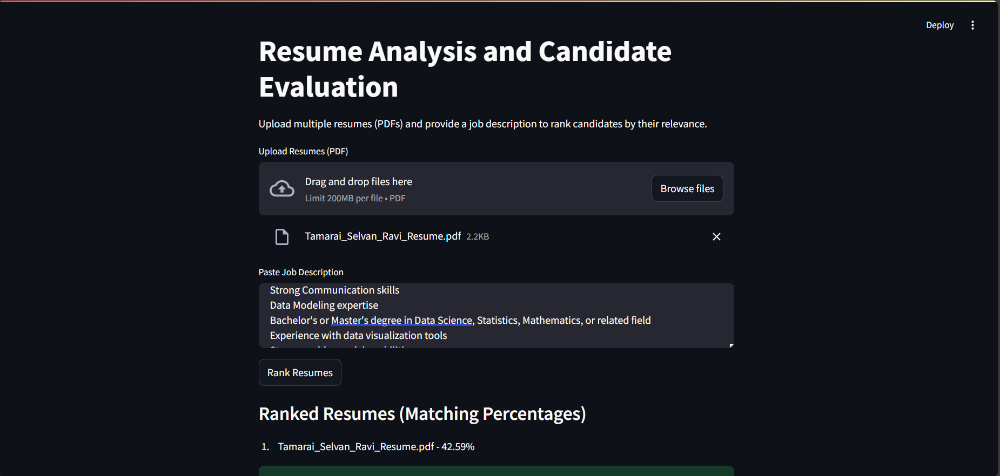

# Resume Ranking and Candidate Evaluation Application

## Table of Contents

- [Introduction](#1-introduction)

- [Objectives](#2-objectives)

- [Technologies Used](#3-technologies-used)

- [Methodology](#4-methodology)

  - [Workflow](#41-workflow)

  - [Key Functions](#42-key-functions)

- [Features](#5-features)

- [Results](#6-results)

- [Challenges](#7-challenges)

- [Future Enhancements](#8-future-enhancements)

- [Conclusion](#9-conclusion)

- [Installation](#10-installation)

- [Usage](#11-usage)

- [Demo](#12-demo)

- [References](#13-references)

- [License](#14-license)

## 1. Introduction

The Resume Ranking and Candidate Evaluation Application is a user-friendly tool designed to streamline the recruitment process. The application enables recruiters to upload resumes in PDF format and compare them against a provided job description. Using Natural Language Processing (NLP) techniques, the app ranks resumes based on their relevance to the job description, providing a data-driven approach to candidate evaluation.

## 2. Objectives

The primary goals of this project include:

- Automating the process of resume evaluation to save time and effort.

- Providing an intuitive interface for recruiters to upload resumes and job descriptions.

- Leveraging state-of-the-art NLP models to evaluate semantic similarity.

- Delivering ranked results to facilitate informed decision-making.

## 3. Technologies Used

- **Streamlit:** Framework for building the web application.

- **Python Libraries:**

  - **pdfplumber:** Extracts text from PDF resumes.

  - **sentence-transformers:** Provides a pre-trained BERT model for semantic similarity computation.

  - **torch:** Supports tensor computations for similarity calculations.

- **Pre-trained Model:** `paraphrase-MiniLM-L6-v2` from the SentenceTransformer library.

## 4. Methodology

### 4.1 Workflow

- **Input Collection:**

  - Users upload multiple resumes in PDF format.

  - Users provide a job description in a text area.

- **Text Extraction:**

  - The app extracts text from the uploaded PDFs using pdfplumber.

  - Handles errors for unreadable or scanned documents.

- **Semantic Similarity Calculation:**

  - The job description and resume texts are encoded into embeddings using the BERT model.

  - Cosine similarity is calculated between the job description embedding and each resume embedding.

- **Ranking and Output:**

  - Resumes are ranked based on similarity scores.

  - Scores are converted to percentages for better interpretation.

  - Results are displayed in descending order of relevance.

### 4.2 Key Functions

- **extract_text_from_pdf:**

  - Extracts text from PDFs using pdfplumber.

  - Handles exceptions for invalid or empty files.

- **calculate_bert_similarity:**

  - Computes cosine similarity using BERT embeddings.

- **convert_to_percentage:**

  - Converts similarity scores to percentages for better readability.

- **main:**

  - Orchestrates the workflow, integrates user inputs, and displays results.

## 5. Features

- **File Upload:**

  - Allows multiple PDF files to be uploaded simultaneously.

- **Error Handling:**

  - Identifies and reports issues with unreadable files.

- **Similarity Scoring:**

  - Leverages a pre-trained BERT model for accurate semantic matching.

- **Ranking Display:**

  - Presents results in a clear and ranked format.

- **Intuitive Interface:**

  - Provides a simple and accessible user experience using Streamlit.

## 6. Results

The application successfully ranked resumes based on their relevance to the provided job description. The output included:

- A ranked list of resumes with matching percentages.

- Error messages for unreadable files, ensuring users are informed of issues.

**Example Output:**

Job Description: "Looking for a data analyst with expertise in Python, SQL, and data visualization."

**Ranked Results:**

1. John_Doe.pdf - 85.32%

2. Jane_Smith.pdf - 74.21%

3. Mark_Lee.pdf - 68.47%

## 7. Challenges

**Handling Scanned Documents:**

- Resumes in scanned format could not be processed due to the limitations of pdfplumber. Future iterations can incorporate OCR technology (e.g., pytesseract).

**Performance with Large Files:**

- Processing very large resumes could lead to slower performance.

## 8. Future Enhancements

- **Integration with OCR:**

  - Add OCR functionality to handle scanned resumes.

- **Advanced Filtering:**

  - Allow recruiters to filter resumes based on custom thresholds.

- **Visualization:**

  - Include graphical representations of matching percentages.

- **Export Results:**

  - Provide an option to download ranked results as a CSV or PDF file.

- **Improved Scalability:**

  - Optimize the app to handle larger datasets and more complex job descriptions.

## 9. Conclusion

The Resume Ranking and Candidate Evaluation Application is a powerful tool that simplifies the hiring process by leveraging NLP and machine learning. It offers recruiters a reliable and efficient way to evaluate resumes, saving time and improving decision-making. With planned enhancements, the application can become even more versatile and robust.

## 10. Installation

1. Install the required dependencies:

   ```bash
   pip install -r requirements.txt
   ```

## 11. Usage

1. Run the Streamlit application:

   ```bash
   streamlit run app.py
   ```

2. Open the local URL provided (e.g., `http://localhost:8501`) in your web browser.

3. Upload resumes in PDF format and paste the job description.

4. Click the "Rank Resumes" button to view the ranked list.

## 12. Demo



## 13. References

- [Streamlit Documentation](https://docs.streamlit.io/)

- [SentenceTransformers Documentation](https://www.sbert.net/)

- [PDFPlumber Documentation](https://github.com/jsvine/pdfplumber)

## 14. License

This project is licensed under the MIT License. See the `LICENSE` file for details.
